# 서울시 상권 유형별 소비 패턴 군집화 분석

- **과목**: 26-1 기계학습 HW2 · Kwangwoon Univ. Information Convergence
- **학번/이름**: 2023510005 김민지
- **Github Repository**: [서울시 상권 유형별 소비 패턴 군집화 분석](https://github.com/kxiarium2003/26-1_ML_seoul-commercial-district-clustering) 
- **데이터 출처**: 서울 열린데이터광장 (2024년 4분기 기준)
- **분석 단위**: 서울시 상권 1,570개
- **Label (y)**: `상권_구분_코드_명` (골목상권 / 발달상권 / 전통시장 / 관광특구)

---

## 목차
1. [분석 개요 및 데이터 수집](#1-분석-개요-및-데이터-수집)
2. [데이터 전처리 및 Feature Engineering](#2-데이터-전처리-및-feature-engineering)
3. [군집화 분석](#3-군집화-분석)
   - [3-1. K-Means](#3-1-k-means)
   - [3-2. Hierarchical Clustering](#3-2-hierarchical-clustering)
   - [3-3. DBSCAN](#3-3-dbscan)
   - [3-4. Affinity Propagation](#3-4-affinity-propagation)
   - [3-5. 알고리즘별 성능 비교](#3-5-알고리즘별-성능-비교)
4. [군집 결과 분석 및 시각화](#4-군집-결과-분석-및-시각화)
   - [4-1. PCA 2D](#4-1-pca-2d-시각화)
   - [4-2. PCA 3D](#4-2-pca-3d-시각화)
   - [4-3. t-SNE](#4-3-t-sne-시각화)
   - [4-4. 전체 알고리즘 비교](#4-4-전체-알고리즘-비교-시각화)
   - [4-5. K-Means 군집 특성 분석](#4-5-k-means-군집-특성-분석-external-evaluation)
5. [결론 및 한계](#5-결론-및-한계)

---

## 1. 분석 개요 및 데이터 수집

### 1-1. 분석 목적

본 프로젝트는 서울시 내 1,570개 상권의 매출 패턴, 점포 구성, 직장인구 배후 수요를 통합하여 **소비 행동 기반의 상권 유형을 자동 분류**하는 것을 목표로 한다. 기존의 행정적 상권 구분(골목상권/발달상권 등)이 아닌, 실제 데이터에서 드러나는 소비 시간대·요일·연령대 패턴을 기반으로 상권의 실질적 특성을 군집화한다. 군집화 알고리즘은 비지도학습이나, 알고리즘의 유효성을 검증하기 위해 행정 구분 label을 활용한 External Evaluation을 병행한다.


### 1-2. 데이터 이해

| 데이터셋 | 원본 크기 | 분석 기여 |
|---|---|---|
| [추정매출-상권](https://data.seoul.go.kr/dataList/OA-15572/S/1/datasetView.do) | 87,179행 × 55열 | 요일별/시간대별/성별/연령대별 매출 비율 → 소비 시간대 패턴 |
| [점포-상권](https://data.seoul.go.kr/dataList/OA-15577/S/1/datasetView.do) | 306,889행 × 14열 | 프랜차이즈 비율, 개폐업률 → 상권 상업적 밀도·안정성 |
| [직장인구-상권](https://data.seoul.go.kr/dataList/OA-15569/S/1/datasetView.do) | 45,840행 × 26열 | 총 직장인구, 성별/연령대 비율 → 배후 수요 특성 |


**[추정매출-상권]** 55개 컬럼, 87,179행 (상권 × 업종 단위)
- 당월 매출금액/건수, 주중·주말, 요일별(7개), 시간대별(6개), 성별(2개), 연령대별(6개) 매출

**[점포-상권]** 14개 컬럼, 306,889행 (상권 × 업종 단위)
- 점포수, 유사업종점포수, 개업률·개업점포수, 폐업률·폐업점포수, 프랜차이즈점포수

**[직장인구-상권]** 26개 컬럼, 45,840행 (상권 × 분기 단위)
- 총직장인구, 남/여, 연령대별(6개), 성별×연령대별(12개) 직장인구

**분석 전략**: 2024년 4분기(20244) 기준으로 필터 후, 상권 단위로 집계하여 **1,570개 상권**을 관측치로 분석

---

**최종 분석 데이터: 1,570개 관측치 × 30개 feature**

| # | 변수명 | 설명 |
|---|---|---|
| 1 | 당월\_매출\_금액 | 상권 전체 월 추정매출 (log 변환) |
| 2 | 주중\_매출\_비율 | 당월 매출 중 평일(월~금) 매출 비중 |
| 3 | 주말\_매출\_비율 | 당월 매출 중 주말(토·일) 매출 비중 |
| 4~10 | 월·화·수·목·금·토·일\_매출\_비율 | 요일별 매출 비중 (7개) |
| 11 | 시간대\_00\~06\_비율 | 심야(자정\~새벽 6시) 매출 비중 |
| 12 | 시간대\_06\~11\_비율 | 오전(6\~11시) 매출 비중 |
| 13 | 시간대\_11\~14\_비율 | 점심(11\~14시) 매출 비중 |
| 14 | 시간대\_14\~17\_비율 | 오후(14\~17시) 매출 비중 |
| 15 | 시간대\_17\~21\_비율 | 저녁(17\~21시) 매출 비중 |
| 16 | 시간대\_21\~24\_비율 | 야간(21\~24시) 매출 비중 |
| 17 | 여성\_매출\_비율 | 당월 매출 중 여성 소비자 비중 |
| 18~23 | 연령대\_10/20/30/40/50/60이상\_비율 | 연령대별 매출 비중 (6개) |
| 24 | 점포\_수 | 상권 내 전체 점포 수 (log 변환) |
| 25 | 프랜차이즈\_비율 | 전체 점포 중 프랜차이즈 점포 비중 |
| 26 | 개업\_비율 | 전체 점포 대비 신규 개업 점포 비중 |
| 27 | 폐업\_비율 | 전체 점포 대비 폐업 점포 비중 |
| 28 | 총\_직장\_인구\_수 | 상권 내 직장 인구 수 (log 변환) |
| 29 | 직장\_여성\_비율 | 직장인구 중 여성 비중 |
| 30 | 직장\_2030\_비율 | 직장인구 중 20·30대 비중 |

### 1-3. Label 분포

| 상권 구분 | 상권 수 | 비율 |
|---|---|---|
| 골목상권 | 1,035 | 65.9% |
| 전통시장 | 280 | 17.8% |
| 발달상권 | 249 | 15.9% |
| 관광특구 | 6 | 0.4% |

> 골목상권이 전체의 약 2/3를 차지하는 **클래스 불균형** 구조이며, 이는 서울 상권 생태계의 실제 현실을 반영한다. 이 불균형은 이후 군집화 성능 해석에 중요한 맥락으로 작용한다.


---

## 2. 데이터 전처리 및 Feature Engineering

### 2-1. 상권 단위 집계

원본 데이터는 **상권 × 업종** 단위이므로, `상권_코드` 기준으로 수치형 변수를 합산하여 상권 단위 분석 테이블로 변환하였다.


### 2-2. 비율 변수 생성 (Feature Engineering 핵심)

절대 매출금액을 그대로 사용하면 매출 규모가 큰 발달상권·관광특구에 군집화 결과가 지배된다. 이를 방지하기 위해 매출의 구성 비율(패턴)에 집중하는 방향으로 변수를 재설계하였다.


$$\text{주중\_매출\_비율} = \frac{\text{주중\_매출\_금액}}{\text{당월\_매출\_금액}}, \quad \text{프랜차이즈\_비율} = \frac{\text{프랜차이즈\_점포\_수}}{\text{점포\_수}}$$

이를 통해 상권의 절대적 규모가 아닌 소비 패턴 자체를 feature로 정의하였다.

### 2-3. 로그 변환 (Log Transformation)

`당월_매출_금액`, `점포_수`, `총_직장_인구_수`는 소수의 대형 상권이 분포 꼬리를 형성하는 Right-skewed 분포를 보인다. `log1p` 변환으로 분포를 정규분포에 근사시켜 거리 기반 알고리즘의 스케일 왜곡을 방지하였다.

### 2-4. 결측치 처리

직장인구 데이터와 매칭되지 않는 상권(6개)은 해당 변수를 0으로 대체하였으며, 당월 매출금액이 0인 상권(데이터 미집계)은 분석에서 제외하였다.

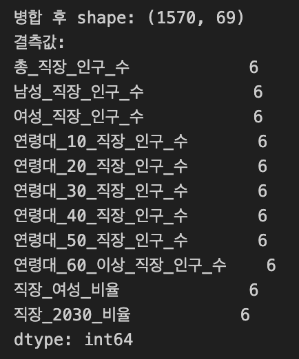

### 2-5. 표준화 (StandardScaler)

K-Means, DBSCAN 등 거리 기반 알고리즘은 변수 간 스케일 차이에 민감하다. 따라서 StandardScaler를 적용하여 전체 30개 feature를 평균 0, 표준편차 1로 정규화하였다.

### 2-6. 최종 Feature 구성 (30개)

| 변수 그룹 | 개수 | 대표 변수 |
|---|---|---|
| 매출 규모 | 1 | 당월\_매출\_금액 (log) |
| 주중/주말 비율 | 2 | 주중\_매출\_비율, 주말\_매출\_비율 |
| 요일별 비율 | 7 | 월요일~일요일\_매출\_비율 |
| 시간대별 비율 | 6 | 00\~06시 \~ 21\~24시 매출\_비율 |
| 성별 비율 | 1 | 여성\_매출\_비율 |
| 연령대별 비율 | 6 | 10대\~60대이상\_매출\_비율 |
| 점포 현황 | 4 | 점포\_수(log), 프랜차이즈·개업·폐업 비율 |
| 직장인구 | 3 | 총\_직장\_인구\_수(log), 여성·2030 비율 |

※ 남성/여성 매출 비율은 합산 시 항상 1이 되는 완전 상관관계이므로, 정보 중복을 피하기 위해 `여성_매출_비율` 1개만 사용하였다.

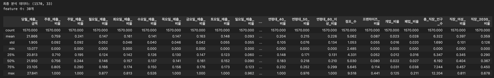
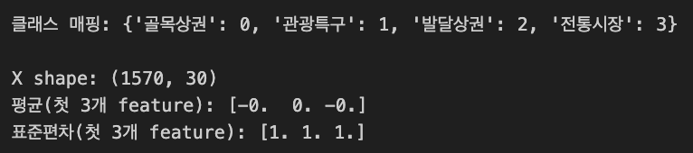

---

## 3. 군집화 분석

### 3-1. $K$-Means

$K$=2~10 범위에서 SSE(Elbow Method)와 Silhouette Score를 동시에 탐색하였다.

| $K$ | 2 | 3 | 4 | 5 | 6 | 7 | 8 | 9 | 10 |
|---|---|---|---|---|---|---|---|---|---|
| Silhouette | 0.1100 | 0.0887 | 0.0781 | 0.0595 | 0.0650 | 0.0688 | 0.0614 | 0.0648 | 0.0470 |

SSE 그래프에서 뚜렷한 elbow가 나타나지 않았으며, Silhouette Score도 전반적으로 낮은 수준을 보였다. 이는 두 가지 구조적 원인에 기인한다.

1. **클래스 불균형**: 골목상권 66%로 인해 단일 거대 클러스터가 지배적
2. **차원의 저주 (Curse of Dimensionality)**: 30차원 공간에서 유클리드 거리가 평준화되어 군집 간 경계가 흐릿해지는 현상

그러나 이는 알고리즘의 실패가 아니다. 서울 상권 생태계의 66%가 골목상권이라는 현실이 **데이터에 충실히 반영된 결과**이며, Silhouette Score와 실제 label 클래스 수(4개)를 종합 고려하여 **$K$=4**를 최종 선택하였다.

- **SSE**: 37,735.39
- **Silhouette Score**: 0.0781

#### SSE 37,735.39 해석
    SSE는 각 관측치와 자신이 속한 군집 중심(centroid) 간 거리 제곱합이다. 절대값 자체는 feature 수와 표준화 스케일에 비례하므로, 30개 feature × 1,570개 관측치 규모에서 이 수치가 크게 나타나는 것은 자연스럽다. 해석의 핵심은 절대값이 아니라 K 증가에 따른 SSE 감소 폭이며, 본 데이터에서 뚜렷한 elbow 없이 완만하게 감소한 것은 군집 간 경계가 모호한 데이터 구조를 반영한다.
#### Silhouette Score 0.0781 해석
    Silhouette Score는 −1~1 범위이며, 1에 가까울수록 군집 내 응집도가 높고 군집 간 분리가 명확하다. 일반적으로 0.5 이상이면 양호, 0.25~0.5는 약한 구조, 0.25 미만은 군집 구조가 불분명한 것으로 해석된다. 0.0781은 낮은 수치이나, 골목상권 66% 불균형과 30차원 거리 평준화를 감안하면 데이터의 구조적 한계가 반영된 결과이다. 양수 값이 나온 것 자체가 완전한 무작위보다는 의미 있는 패턴을 포착했음을 뜻한다.

#### 군집 크기 및 실제 label 대응
|군집|크기|주요 구성 상권|해석|
|---|---|---|---|
|Cluster 0|260|골목상권 다수|주중·점심 집중 → 오피스 밀착형 골목상권|
|Cluster 1|350|골목상권 + 전통시장|주말·야간 강세 → 주거지 배후 여가형|
|Cluster 2|633|골목상권 최다|전 시간대 고른 분포, 매출 규모 최대 → 핵심 발달상권|
|Cluster 3|327|전통시장 + 관광특구 포함|심야·야간 특화 → 야간·관광형|

K-Means가 행정 구분과 완전히 일치하지 않는 것은 당연하다. 하나의 군집에 여러 행정 구분이 혼재하는 것은, 행정 구분이 실제 소비 패턴을 완전히 포착하지 못함을 보여주는 결과이기도 하다.

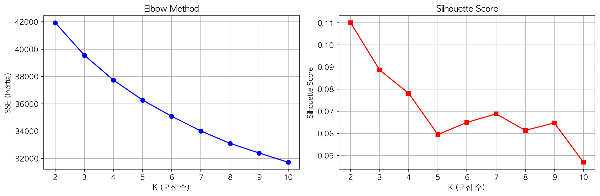
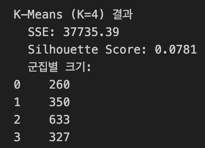

---

### 3-2. Hierarchical Clustering

Ward, Complete, Average 세 가지 linkage를 $K$=4 기준으로 비교하였다. Linkage는 계층적 군집화에서 두 군집 간 거리를 측정하는 방식으로, 선택에 따라 군집의 형태와 크기 분포가 크게 달라진다.

- **Ward**: 두 군집을 합쳤을 때 SSE(군집 내 분산)가 얼마나 증가하는지를 거리로 사용. 군집 크기가 균형 잡히는 경향이 있어 일반적으로 가장 많이 사용된다.
- **Complete**: 두 군집에서 가장 멀리 있는 두 점 사이의 거리를 기준으로 사용. 촘촘하고 컴팩트한 군집을 만드는 경향이 있다.
- **Average**: 두 군집의 모든 점 쌍 간 거리의 평균을 기준으로 사용. 아래에서 설명하듯, Silhouette 계산 방식과 척도가 동일하여 수치가 inflate될 수 있다.

| Linkage | Silhouette | 군집 크기 분포 |
|---|---|---|
| ward | 0.0575 | 716 / 425 / 211 / 218 (균형) |
| complete | 0.7133 | 1 / 1,566 / 1 / 2 (극단 불균형) |
| average | 0.7134 | 1 / 1,566 / 1 / 2 (극단 불균형) |

**Average/Complete linkage의 Silhouette 0.71은 수치적 왜곡(Metric Inflation)이다.** Silhouette $S(i)$는 아래와 같이 평균 거리 기반으로 정의된다.

$$S(i) = \frac{b(i) - a(i)}{\max(a(i),\ b(i))}$$

여기서 $a(i)$는 동일 군집 내 평균 거리, $b(i)$는 가장 가까운 타 군집까지의 평균 거리이다. Average linkage가 동일한 평균 거리를 최적화하므로 이 척도에서 인위적으로 높은 수치가 산출된다. 실제 군집 구조를 확인하면 1,566개 상권이 단일 군집으로 쏠려 있어 분류 능력이 전무하다.

Ward linkage(0.0575)는 군집 크기가 균형 있게 배분되고 PCA 2D 시각화에서 군집 간 분리가 명확하여 분석적으로 더 유의미한 결과를 제공한다.

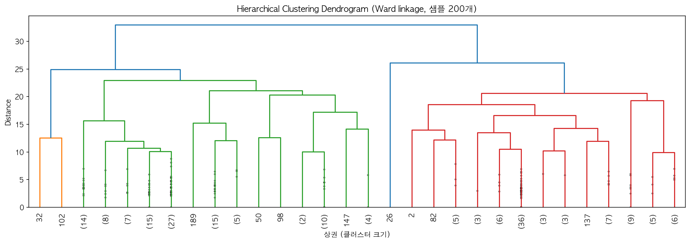
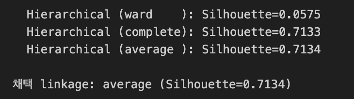
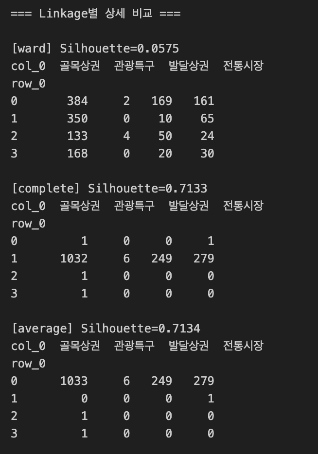
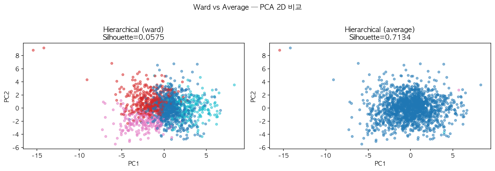

---

### 3-3. DBSCAN

k-NN 거리 그래프($k$=5)를 통해 $\epsilon$ 후보를 파악하고, $\epsilon$(1.5~3.5) × `min_samples`(3~10) 그리드 탐색을 수행하였다.

| $\epsilon$ | min\_samples | n\_clusters | noise\_ratio | Silhouette |
|---|---|---|---|---|
| 2.0 | 3 | 9 | 0.845 | -0.2946 |
| 3.0 | 3 | 2 | 0.416 | 0.0688 |
| 3.5 | 3 | 2 | 0.278 | 0.1452 |
| **3.5** | **4** | **1** | **0.285** | **-** |

모든 파라미터 조합에서 노이즈 비율이 최소 27.8%로 높게 나타났다. 최종 선택한 $\epsilon$=3.5, `min_samples`=4에서 유효 군집 수가 1로 수렴하였다.

**이는 서울 상권 데이터가 DBSCAN이 전제하는 명확한 밀도 경계를 갖지 않는 구조임을 의미한다.** 골목상권 1,035개가 서울 전역에 연속적으로 분포하여 고밀도 클러스터를 형성하지 않으며, 이는 알고리즘 실패가 아닌 데이터의 분포적 특성을 알고리즘이 정확히 포착한 결과이다.

- 군집 수: 1 (노이즈 448개 / Cluster 0 1,122개)
- 노이즈 비율: 0.285

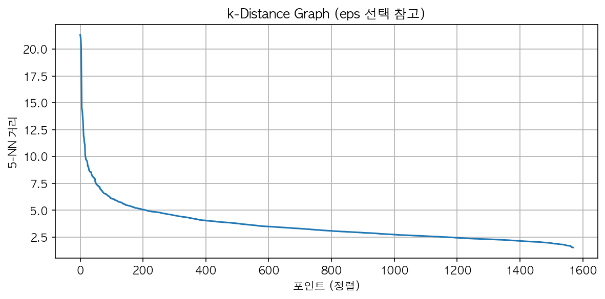
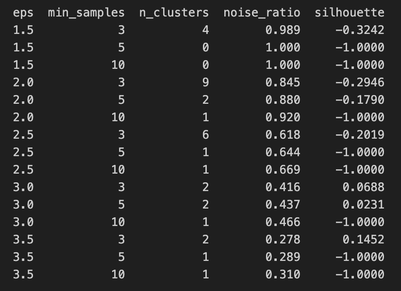  
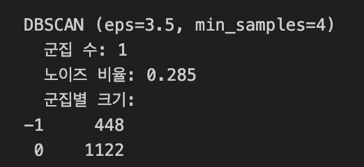

---

### 3-4. Affinity Propagation

AP는 데이터 포인트끼리 "나를 exemplar(대표점)로 삼아라" / "나는 너를 지지한다"는 메시지를 반복 교환하며 수렴하는 알고리즘이다. 두 핵심 하이퍼파라미터는 다음과 같다.

- **Damping**: 메시지 업데이트 시 이전 값과 현재 값을 혼합하는 비율($0.5$~$1.0$). 값이 높을수록 변화를 천천히 반영하여 수렴 안정성이 높아지나 군집 수가 줄어드는 경향이 있다.
- **Preference**: 각 포인트가 스스로 exemplar가 될 가능성을 조절하는 값. 0에 가까울수록 군집 수가 많아지고, 음수 절댓값이 클수록 exemplar 경쟁이 억제되어 군집 수가 줄어든다. AP는 $K$처럼 군집 수를 직접 지정할 수 없으므로 preference를 통해 간접 조절한다.

500개 샘플에 대해 damping(0.5~0.9)을 탐색한 결과 최적 `damping`=0.7을 선택하였다. 이후 전체 1,570개 데이터에 대해 `preference`를 변화시키며 군집 수를 조절하였다. 또한 AP는 $O(n^2)$ 시간 복잡도를 가지므로, 탐색 단계에서 전체 1,570개 대신 500개 샘플로 `damping`을 먼저 탐색한 뒤 전체 데이터에 적용하였다.

| preference | n\_clusters | Silhouette |
|---|---|---|
| -200 | 32 | 0.0272 |
| -150 | 43 | 0.0203 |
| -100 | 60 | 0.0257 |
| -75 | 85 | 0.0234 |
| -50 | 140 | 0.0263 |
| -30 | 243 | 0.0336 |

유효 군집 수 범위(2~20)를 달성하는 `preference`가 존재하지 않아, 최소 군집 기준으로 **`preference`=-200 ($n$=32)** 을 채택하였다. AP는 모든 데이터 포인트가 exemplar 후보가 되는 알고리즘 특성상 데이터 밀도가 불균일한 본 데이터셋에서 과도한 세분화 경향을 보였다.

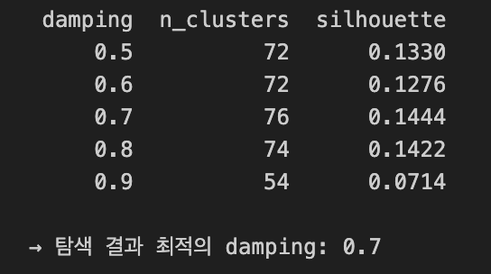  
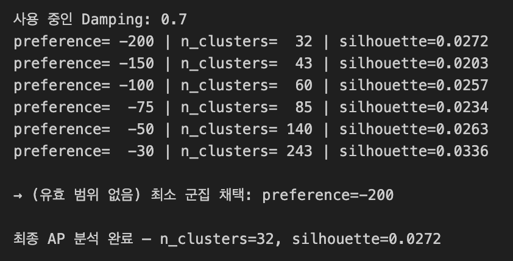

---

### 3-5. 알고리즘별 성능 비교

| 알고리즘 | 주요 하이퍼파라미터 | 군집 수 | SSE | Silhouette |
|---|---|---|---|---|
| **$K$-Means** | $K$=4 | **4** | 37,735.39 | **0.0781** |
| Hierarchical | linkage=average | 4 | - | 0.7134 ※ |
| DBSCAN | $\epsilon$=3.5, min\_samples=4 | 1 | - | - † |
| Affinity Propagation | damping=0.7, preference=-200 | 32 | - | 0.0272 |

> ※ SSE는 군집 중심(centroid)이 명시적으로 정의된 $K$-Means에서만 산출 가능하다. Hierarchical, DBSCAN, AP는 centroid를 정의하지 않으므로 SSE 계산 대상이 아니다.
>
> ※ Average linkage의 Silhouette 0.7134는 1,566개 상권이 단일 군집으로 쏠리는 극단적 불균형에서 발생한 Metric Inflation으로, 실질적인 군집 분류 능력이 없다. Ward linkage($S$=0.0575)가 균형 있는 분할과 시각적으로 유의미한 분리를 제공하여 분석 목적에 더 적합하다.
>
> ※ DBSCAN Silhouette은 유효 군집 수가 2개 이상이어야 계산 가능하다. 본 분석에서 유효 군집이 1개로 수렴하였으므로 계산 불가이며, 노이즈 포인트(-1)는 Silhouette 계산 대상에서도 제외된다.

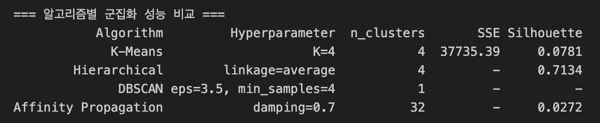

---

## 4. 군집 결과 분석 및 시각화

### 4-1. PCA 2D 시각화

30개 feature를 PCA로 2차원 축소하여 실제 label 및 $K$-Means 군집 결과를 비교하였다. 실제 label 기준으로 **관광특구와 발달상권은 비교적 분리된 영역**에 위치하나, 골목상권과 전통시장은 상당 부분 겹쳐 있다. 이는 두 유형이 규모 차이는 있지만 소비 패턴의 본질적 차이가 크지 않음을 시사한다.

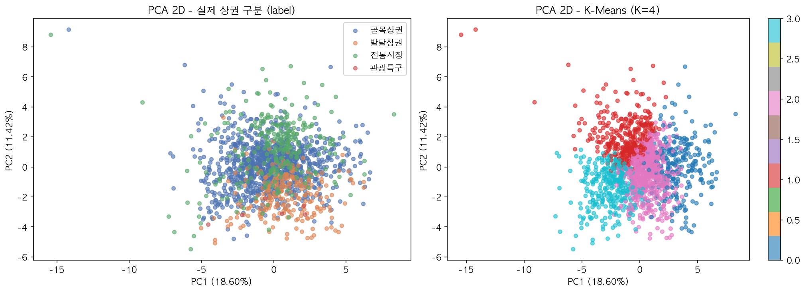

---

### 4-2. PCA 3D 시각화

3차원으로 확장 시 누적 설명 분산이 증가하며, **관광특구 6개 상권이 뚜렷하게 격리된 위치**에 투영된다. 이는 관광특구가 매출 규모와 야간 시간대 비율에서 다른 상권과 본질적으로 다른 특성을 가짐을 3D 공간에서 시각적으로 확인한 것이다.

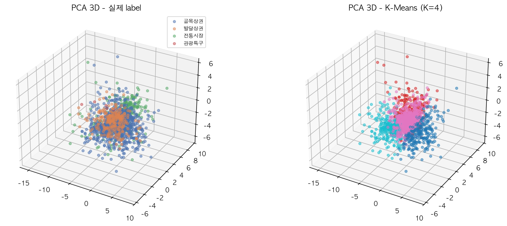

---

### 4-3. t-SNE 시각화

t-SNE(`perplexity`=30)는 PCA의 선형 투영과 달리 비선형 다양체 구조를 보존하므로 국소적 군집 패턴을 더 잘 드러낸다. 시각화 결과 $K$-Means 군집들이 t-SNE 공간에서 유의미하게 응집되어 있으며, PCA에서 겹쳐 보이던 골목상권 내부도 어느 정도 분리된 구조가 확인된다.

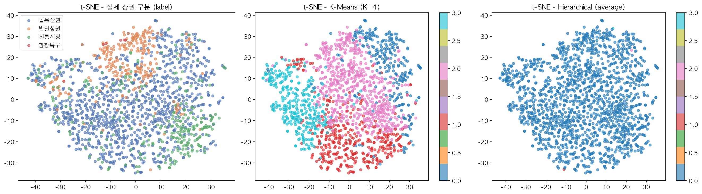

---

### 4-4. 전체 알고리즘 비교 시각화 (PCA 2D)

네 알고리즘의 군집 결과를 PCA 2D 공간에 나란히 시각화하였다. $K$-Means와 Ward Hierarchical은 유사한 공간적 분할 패턴을 보인 반면, DBSCAN은 단일 군집 + 노이즈 구조로 수렴하였고, AP는 32개로 과도하게 세분화된 패턴을 보였다.

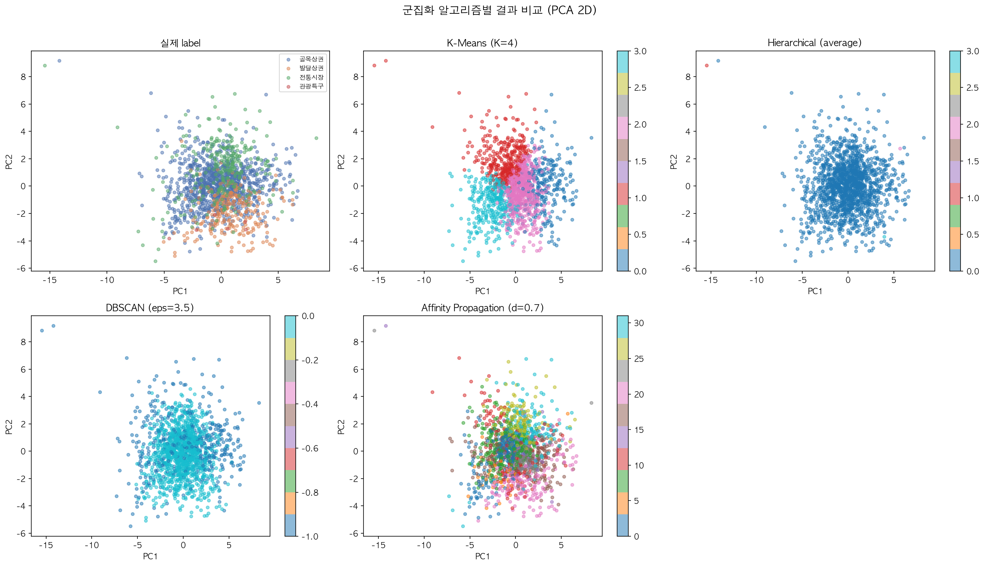

---

### 4-5. $K$-Means 군집 특성 분석 (External Evaluation)

**군집 vs. 실제 상권 구분 크로스탭**

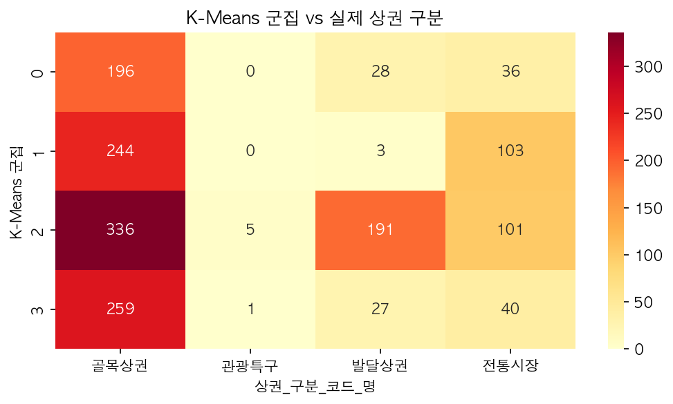

**군집별 소비 패턴 프로파일 및 페르소나**

| 군집 | 페르소나 | 주요 특징 |
|---|---|---|
| **Cluster 0** | 오피스 밀착형 | 주중 매출 비율 0.890 (최고), 점심 시간대(11~14시) 0.338 (최고), 월~금 강세 |
| **Cluster 1** | 여가·유흥형 | 주말 매출 비율 0.316, 저녁~심야(17~24시) 강세, 토·일 매출 높음 |
| **Cluster 2** | 핵심 발달상권 | 당월 매출금액 23.059 (최고), 전 시간대 고른 매출, 프랜차이즈 밀집 |
| **Cluster 3** | 야간·관광 특화 | 새벽 시간대(00~06시) 비율 0.071 (최고), 야간 매출 강세, 관광특구 포함 |

**군집 구분의 핵심 변수**: 주중 매출 비율이 Cluster 0(0.890) vs Cluster 1(0.684) 간 가장 큰 차이를 보여, 동일한 '골목상권' 행정 구분 안에서도 오피스형과 유흥형을 정량적으로 분리하는 핵심 지표로 확인되었다.

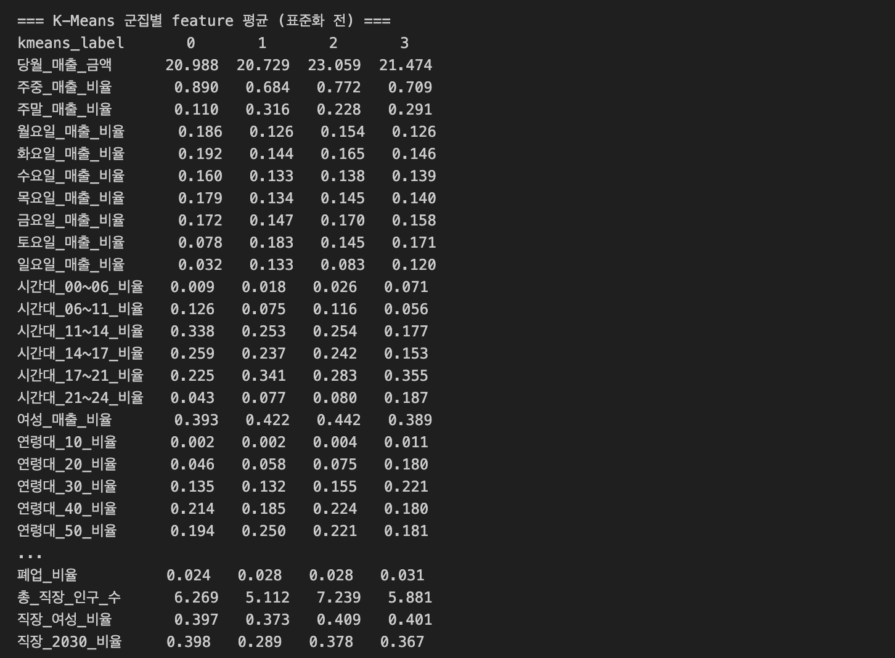
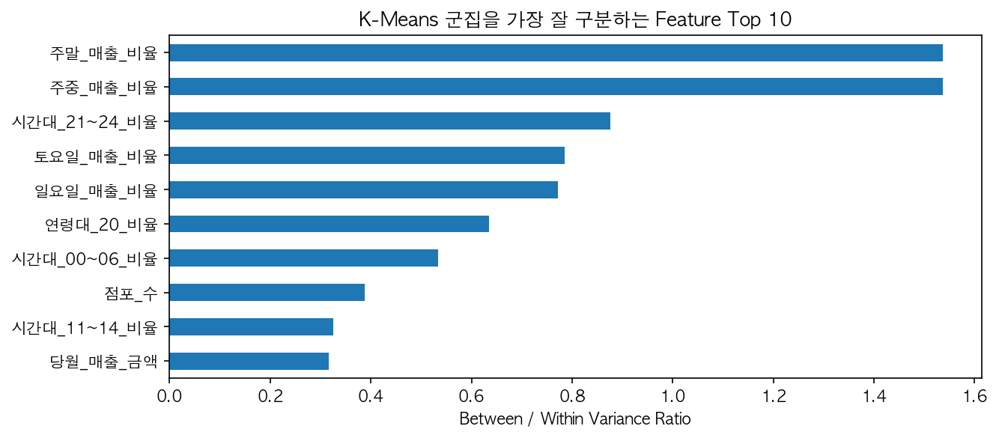

---

## 5. 결론 및 한계

### 결론

**본 분석은 행정적 편의에 의해 구분된 서울시 상권 분류가 실제 소비자의 시공간적 패턴을 충분히 반영하지 못함을 정량적으로 검증하였다.** $K$-Means($K$=4)가 가장 해석 가능한 군집 구조를 제공하였으며, 주중/주말 매출 비율과 시간대별 매출 분포가 상권 유형을 구분하는 핵심 변수로 확인되었다.

특히 동일한 '골목상권' 행정 구분 안에서 '오피스 밀착형(Cluster 0)'과 '여가·유흥형(Cluster 1)'이 명확히 분리된 점은, 데이터 기반 군집화가 행정 구분보다 상권의 실제 기능을 더 정확히 포착함을 보여준다. 이는 서울시 상권 활성화 정책 수립 시, 단순 행정 구분이 아닌 **소비 패턴 기반의 맞춤형 지원 전략**의 필요성을 시사한다.

### 한계 및 향후 과제

| 한계 | 원인 | 향후 방향 |
|---|---|---|
| 낮은 Silhouette Score | 골목상권 66% 클래스 불균형, 30차원 차원의 저주 | SMOTE 등 오버샘플링, PCA 전처리 후 군집화 |
| DBSCAN 군집화 수렴 | 상권의 연속적 밀도 구조 | HDBSCAN 등 계층적 밀도 기반 알고리즘 적용 |
| AP 과분할 | exemplar 기반 알고리즘의 특성, $O(n^2)$ 복잡도 | Mini-batch $K$-Means, Spectral Clustering 비교 |
| 직장인구 일부 결측 | 6개 상권 데이터 미매칭 | 유동인구 데이터 추가 활용 |

---

## 실행 방법

```bash
pip install scikit-learn pandas numpy matplotlib seaborn scipy

# 데이터 파일을 Data/ 폴더에 위치시킨 후
jupyter notebook Clustering.ipynb
```

## 파일 구조

```
ML_HW2_seoul-commercial-district-clustering/
├── Data/                              # CSV 데이터 파일 (gitignore)
│   ├── 서울시_상권분석서비스(추정매출-상권)_2024년.csv
│   ├── 서울시_상권분석서비스(점포-상권)_2024년.csv
│   └── 서울시_상권분석서비스(직장인구-상권)_2024년.csv
│
├── Outputs/                           # 코드 실행으로 생성된 plot PNG
│   ├── plot_kmeans_tuning.png         # Elbow + Silhouette 그래프
│   ├── plot_dendrogram.png            # Ward linkage Dendrogram
│   ├── plot_hier_ward_vs_average.png  # Ward vs Average PCA 비교
│   ├── plot_kdistance.png             # k-dist graph
│   ├── plot_pca2d.png                 # PCA 2D 시각화
│   ├── plot_pca3d.png                 # PCA 3D 시각화
│   ├── plot_tsne.png                  # t-SNE 시각화
│   ├── plot_all_comparison.png        # 전체 알고리즘 비교
│   ├── plot_kmeans_heatmap.png        # K-Means 히트맵
│   └── plot_feature_importance.png    # Feature 기여도 barh
│
├── Images/                            # 보고서 삽입용 스크린샷
│   ├── df_store/sales/work.png        # 각 데이터셋 shape + head(5)
│   ├── 2_1_aggregation.png            # 상권 단위 집계 결과
│   ├── 2_4_merge.png                  # 병합 결과 + 결측값
│   ├── 2_6_describe1/2.png            # 최종 feature 구성 및 X shape
│   ├── 3_1_kmeans_result.png          # K-Means 최종 결과 출력
│   ├── 3_2_linkage_compare1/2.png     # linkage별 Silhouette + 크로스탭
│   ├── 3_3_dbscan_grid.png            # 그리드 탐색 결과 표
│   ├── 3_3_dbscan_result.png          # DBSCAN 최종 결과
│   ├── 3_4_ap_damping.png             # damping 탐색 표
│   ├── 3_4_ap_preference.png          # preference 루프 결과
│   ├── 3_5_comparison.png             # 알고리즘 성능 비교 표
│   └── 4_5_cluster_profile.png        # 군집별 feature 평균 표
│
├── Clustering.ipynb
├── README.md
└── .gitignore
```